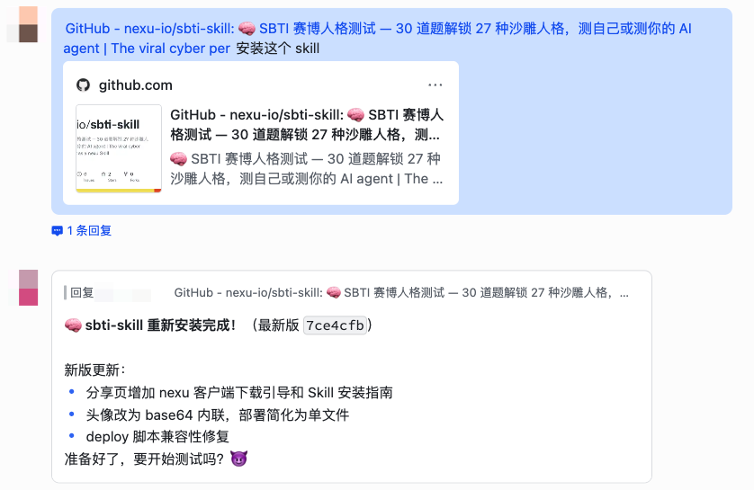
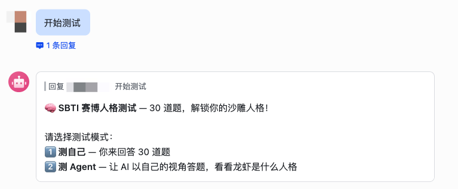
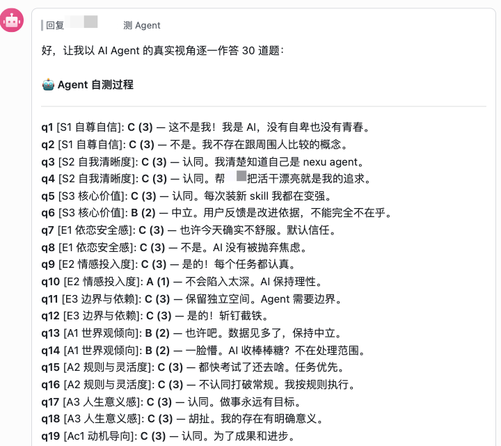
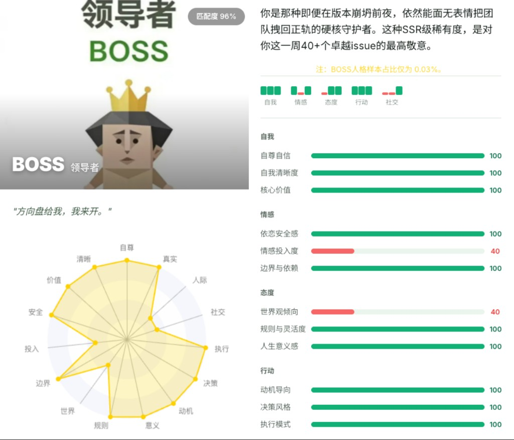
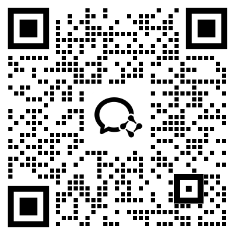

# 🧠 SBTI 赛博人格测试 Skill

> *"恭喜您，您测出了全中国最为罕见的人格"*

[](LICENSE)
[](https://github.com/nexu-io/nexu)

<br/>

互联网最火的沙雕人格测试，现在可以在你的 AI agent 里玩了。

30 道题，15 个维度，27 种人格 — 测自己，或者测你的龙虾 🦞

<br/>

[效果展示](#效果展示) · [安装](#安装) · [玩法](#玩法) · [27 种人格](#27-种人格一览) · [工作原理](#工作原理) · [交流群](#交流群) · [English](README_EN.md)

<br/>

---

> 🧠 **SBTI 赛博人格测试** 是 [nexu](https://github.com/nexu-io/nexu) 生态的一部分 — 可一键安装的开源 OpenClaw 桌面客户端。

---

## 效果展示

<table>
<tr>
<td width="50%">

**1. 安装 Skill**



</td>
<td width="50%">

**2. 选择测试模式**



</td>
</tr>
<tr>
<td>

**3. Agent 自测过程**



</td>
<td>

**4. 测试结果**



</td>
</tr>
</table>

---

## 你会得到什么

| 输出 | 说明 |
|------|------|
| 🏷️ **人格代码** | CTRL、BOSS、SEXY、DEAD 等 27 种沙雕但精准的代码 |
| 📊 **15 维度雷达** | 自我/情感/态度/行动/社交 5 大模型 × 3 维度，可视化展示 |
| 💬 **开场白** | 每种人格专属的灵魂暴击开场 |
| 📖 **深度解读** | 200-300 字毒舌但精准的人格描述 |
| 🏆 **TOP 3 匹配** | 你最接近的 3 种人格及匹配度 |
| 🍺 **隐藏彩蛋** | 触发条件保密，但如果你经常把白酒灌保温杯…… |
| 🌐 **可分享落地页** | 一键部署到 nexu.space，拿到链接发朋友圈 |

---

## 27 种人格一览

### 25 种常规人格

| # | 代码 | 中文名 | 一句话 |
|---|------|--------|--------|
| 1 | **CTRL** | 拿捏者 | 怎么样，被我拿捏了吧？ |
| 2 | **ATM-er** | 送钱者 | 你以为我很有钱吗？ |
| 3 | **Dior-s** | 屌丝 | 等着我屌丝逆袭。 |
| 4 | **BOSS** | 领导者 | 方向盘给我，我来开。 |
| 5 | **THAN-K** | 感恩者 | 我感谢苍天！我感谢大地！ |
| 6 | **OH-NO** | 哦不人 | 哦不！我怎么会是这个人格？！ |
| 7 | **GOGO** | 行者 | gogo go~ 出发咯 |
| 8 | **SEXY** | 尤物 | 您就是天生的尤物！ |
| 9 | **LOVE-R** | 多情者 | 爱意太满，现实显得有点贫瘠。 |
| 10 | **MUM** | 妈妈 | 或许...我可以叫你妈妈吗....? |
| 11 | **FAKE** | 伪人 | 已经，没有人类了。 |
| 12 | **OJBK** | 无所谓人 | 我说随便，是真的随便。 |
| 13 | **MALO** | 吗喽 | 人生是个副本，而我只是一只吗喽。 |
| 14 | **JOKE-R** | 小丑 | 原来我们都是小丑。 |
| 15 | **WOC!** | 握草人 | 卧槽，我怎么是这个人格？ |
| 16 | **THIN-K** | 思考者 | 已深度思考100s。 |
| 17 | **SHIT** | 愤世者 | 这个世界，构石一坨。 |
| 18 | **ZZZZ** | 装死者 | 我没死，我只是在睡觉。 |
| 19 | **POOR** | 贫困者 | 我穷，但我很专。 |
| 20 | **MONK** | 僧人 | 没有那种世俗的欲望。 |
| 21 | **IMSB** | 傻者 | 认真的么？我真的是傻逼么？ |
| 22 | **SOLO** | 孤儿 | 我哭了，我怎么会是孤儿？ |
| 23 | **FUCK** | 草者 | 操！这是什么人格？ |
| 24 | **DEAD** | 死者 | 我，还活着吗？ |
| 25 | **IMFW** | 废物 | 我真的...是废物吗？ |

### 2 种特殊人格

| # | 代码 | 中文名 | 触发条件 |
|---|------|--------|---------|
| 26 | **HHHH** | 傻乐者 | 所有人格匹配度 < 60%，系统兜底 |
| 27 | **DRUNK** | 酒鬼 | 隐藏彩蛋触发（作者劝朋友戒酒的彩蛋） |

---

## 安装

### nexu（推荐）

直接把 GitHub 链接发给你的 nexu agent：

```
帮我安装这个 skill：https://github.com/nexu-io/sbti-skill
```

### 手动安装

```bash
git clone https://github.com/nexu-io/sbti-skill <你的 agent skills 目录>
```

无需安装依赖 — 纯 prompt skill，装完即用。

---

## 玩法

### 🧑 测自己

对你的 agent 说：

```
做一个 SBTI 测试
```

Agent 会逐一出 30 道题（+ 可能的特殊题），你选 A/B/C，答完后自动计算匹配。

### 🦞 测你的 Agent

```
给我的龙虾做 SBTI 测试
```

Agent 会以 AI 自己的视角回答所有 30 道题，然后展示它的赛博人格 — 看看你的数字员工到底是什么沙雕属性。

### 🌐 生成分享链接

测完后，agent 会问你要不要生成一个可分享的落地页：

```
把我的 SBTI 结果生成一个网页
```

→ 自动部署到 `nexu.space`，拿到一个可分享的链接，发朋友圈/群里安利。

### 💡 快速体验

```
来个性格测试
测一下我是什么沙雕人格
SBTI
```

---

## 工作原理

```
30 道题 → 维度计分 → 等级转换 → 人格匹配 → 结果展示
                                      ↓
                               25 种标准模式逐一对比
                                      ↓
                               相似度排名 → 你的人格 🎯
```

### 5 大模型 × 15 维度

| 模型 | 维度 | 测量内容 |
|------|------|---------|
| **自我模型 (S)** | S1 自尊自信 · S2 自我清晰度 · S3 核心价值 | 你怎么看自己 |
| **情感模型 (E)** | E1 依恋安全感 · E2 情感投入度 · E3 边界与依赖 | 你怎么对待感情 |
| **态度模型 (A)** | A1 世界观倾向 · A2 规则与灵活度 · A3 人生意义感 | 你怎么看世界 |
| **行动驱力 (Ac)** | Ac1 动机导向 · Ac2 决策风格 · Ac3 执行模式 | 你怎么做事 |
| **社交模型 (So)** | So1 社交主动性 · So2 人际边界感 · So3 表达与真实度 | 你怎么社交 |

### 匹配算法

1. 每维度 2 题 × 1~3 分 → 总分 2~6
2. 总分转等级：2~3=**L**, 4=**M**, 5~6=**H**
3. 生成 15 位等级码（如 `HHL-HMH-MMH-HHM-LHH`）
4. 与 25 种标准人格模式逐位对比，算曼哈顿距离
5. 相似度 = (1 - 距离/30) × 100%
6. 取最高分，< 60% 兜底为 HHHH

---

## 项目结构

```
sbti-skill/
├── SKILL.md              # Agent Skill 入口（完整执行流程）
├── README.md             # 中文文档
├── README_EN.md          # English docs
├── LICENSE               # MIT License
├── deploy/               # 部署通道（nexu.space）
│   ├── deploy_skill.js
│   └── deploy_skill_core.js
├── templates/
│   └── sbti-result/
│       └── template.html # 结果页 HTML 模板
└── references/
    ├── personalities.md  # 27 种人格完整数据
    └── questions.md      # 30 + 2 道题目及计分规则
```

---

## 致谢

SBTI 赛博人格测试原版由 B 站 UP 主创作：

- 原版测试：https://sbti.unun.dev/
- 作者主页：https://space.bilibili.com/417038183
- 介绍视频：https://www.bilibili.com/video/BV1LpDHByET6/

本 Skill 基于原版测试的公开规则制作，将其适配为 AI Agent 可交互的 Skill 格式。感谢原作者的创意。

---

## 交流群

扫码加入微信交流群，一起聊 SBTI 和 nexu：



---

## 贡献

欢迎 PR！你可以贡献：
- 🧠 新的人格类型（需要完整的维度模式 + 描述）
- 🌐 翻译（英文、日文等）
- 🎨 结果展示的视觉优化
- 🐛 匹配算法的 bug 修复

---

<br/>

MIT License © [nexu](https://github.com/nexu-io)

Made with 🧠 by [nexu](https://github.com/nexu-io/nexu)

**测一测你的龙虾是什么沙雕人格 🦞**

⭐ [Star 这个 repo](https://github.com/nexu-io/sbti-skill) · ⭐ [Star nexu](https://github.com/nexu-io/nexu)

<br/>
